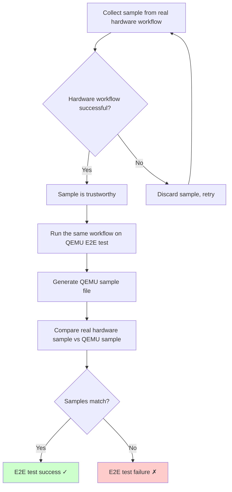

# &#x1F44B; Zarhus Developers Meetup #2 &#x1F389;

## Dasharo Tools Suite Status

### Q3 2025

    

---
layout: two-cols-header
---

## Agenda

* What is DTS?
* DTS statistics Q3-Q4 2024.
  + Issues
  + Contributions.
  + Features.
  + Hardware support.
* DTS current architecture and tests.
* DTS new architecture and tests.
* Roadmap Q1-Q2 2025
* Q&A

---
layout: two-cols-header
---

# What is DTS?

  

* A set of tools running in a Yocto-based image
* Provide better Dasharo user experience
  - Dasharo deployment
  - Dasharo update
  - DPP access
  - Switching from one Dasharo flavor to another (e.g. UEFI <---> heads)
  - HCL report
* https://docs.dasharo.com/dasharo-tools-suite/overview/  

<!--
Slide taken from:
https://github.com/Dasharo/presentations/blob/main/dug_8/dug_8_dasharo_tools_suite_status.md

- Time for this slide: 50s
- Idea/goal of this slide: Present DTS
- What to say: "What is DTS? DTS states for Dasharo Tools Souite and is a tiny
Linux Kernel built for 64-bit x86with goal to make Dasharo user experience
easier. Actually, it could be thought of as a solid and secure bridge between a
user and Dasharo. It has several Dasharo and Coreboot tools built in, as well
as other, firmware related tools for enhanced debugging and programming. But
most importantly, it has a layer of automation and GUI scripts that make DTS
more user-friendly."
-->

---
layout: two-cols-header
---

# What is DTS?

---
layout: two-cols-header
---

## DTS components

* Issues
  - [DasharoToolsSuite](https://github.com/Dasharo/dasharo-issues/issues?q=is%3Aissue%20state%3Aopen%20label%3ADasharoToolsSuite)
  label in [dasharo-issues](https://github.com/Dasharo/dasharo-issues) repo 
* Repositories
  - [dts-scripts](https://github.com/Dasharo/dts-scripts)
    + Main DTS logic 
  - [meta-dts](https://github.com/Dasharo/meta-dts/)
    + Yocto meta layer
    + Integration of dts-scripts and tools
  - Tests in [OSFV repo](https://github.com/Dasharo/open-source-firmware-validation/tree/develop/dts)
    + DTS tests placed under `dts` directory

---
layout: two-cols-header
---

## Timeframe

* The last DTS status presentation
  - DUG#8 (December 2024)
  - https://cfp.3mdeb.com/developers-vpub-0xd-2024/talk/QKJYGJ/
* We cover here
  - Q1-Q3 2025 - in terms of status report
  - Q3-Q4 2025 - in terms of plans  

  

---
layout: two-cols-header
---

## Statistics - issues

<!--

- steady growth of open issues
- decreasing number of closed issues my be concerning

Issues statistics retrieved by script from dasharo/presentations repo:
./diagrams/dts_issues.py 

-->

---
layout: two-cols-header
---

## Statistics - dts-scripts PRs

<!--

PR statistics retrieved by script from dasharo/presentations repo:
./diagrams/dasharo_forks.py 

(Manually modified date and stopeed generation for other repos to save time,
script might be made more generic to fit both DUG and ZDM).

-->

---
layout: two-cols-header
---

## Statistics - meta-dts PRs

<!--

PR statistics retrieved by script from dasharo/presentations repo:
./diagrams/dasharo_forks.py 

(Manually modified date and stopeed generation for other repos to save time,
script might be made more generic to fit both DUG and ZDM).

-->

---
layout: two-cols-header
---

## Upstreaming

 

* Not much going on
* We can do better
* We certainly do not lack opportunities
  - We often add something to `meta-dts` (not upstream layer) and never go back to it

---
layout: two-cols-header
---

## Recent changes

- 2.1.1 (13/12/2024)
  - Fix for release for NS50 11th Gen NovaCustom series
- 2.1.2 (20/12/2024)
  - HCL report and DPP credentials fixes

---
layout: two-cols-header
---

## Recent changes

- 2.1.3 (03/01/2025)
  - Fix for logs not being sent after update
- 2.2.0 (30/01/2025)
  - Add support for NovaCustom V56TU heads flavor

---
layout: two-cols-header
---

## Recent changes

- 2.2.1 (05/02/2025)
  - Fix ODROID-H4 firmware update/deployment
- 2.3.0 (20/03/2025)
  - Add support for NovaCustom V54TU heads flavor

---
layout: two-cols-header
---

## Recent changes

- 2.4.0 (31/03/2025)
  - Use MinIO for DPP
    + Replaced nextcloud share with S3-compatible object storage
    + Single set of credentials per user for a lifetime (previously: per user **and** per product)
    + Delivered new set of credentials to existing users
    + https://www.min.io/

 
 

---
layout: two-cols-header
---

## Recent changes
- 2.5.0 (11/06/2025)
  - Add SeaBIOS support (PC Engines APU2/3/4/6)

---
layout: two-cols-header
---

## Ongoing work 

* Current Problem
  - E2E Tests don't match real workflows
  - Some platform-dependent steps not executed in emulation tests right now
* Proposal
  - Modify DTS calls to allow for samples collection
  - Record commands calls and exit codes
  - Run the same commands in emulated environment and compare
  - https://github.com/Dasharo/open-source-firmware-validation/issues/653

---
layout: two-cols-header
---

## Ongoing work 

  

  

---
layout: two-cols-header
---

## Roadmap

 

---
layout: cover
background: /intro.png
class: text-center
---

## Q&A

    

