```mermaid
sequenceDiagram
    participant App as Application
    participant Encryption as Encryption Layer
    participant Disk as Disk Storage

    App->>+Encryption: write(userData)
    Note over Encryption: Automatically encrypts<br/>with symmetric key
    Encryption->>+Disk: write(encryptedData)
    Disk-->>-Encryption: success
    Encryption-->>-App: success

    Note over App,Disk: 🔒 Data encrypted before committing to disk
```

# 👋 Zarhus Developers Meetup #3 🎉

## Hardware-Backed Security in Android

    

---
layout: cover
background: /intro.png
class: text-center
theme: ../slidev-template/theme
---

# Trusted Execution Environment (TEE)

---
layout: two-cols-header
---

# TEE

::left::

::right::

- Typically implemented as TrustZone on ARM processors
- Hardware-enforced isolated environment
- Provides trusted execution environment for confidential operations
- REE (Android OS) is considered unstrusted
- Small TEE OS separated from the main OS
- Trusted Apps provide critical security services

<!--

The ARM based processor on Android devices provides a Trusted Execution
Environment (TEE), often implemented as TrustZone. This secondary, isolated
environment virtualizes the main processor, creating a secure trusted execution
environment for confidential operations.

Android's main operating system, the Rich Execution Environment (REE), is
considered "untrusted." It cannot access sensitive areas of RAM, hardware
registers, or write-once fuses where manufacturers store secret data, such as
device-specific cryptographic keys. Any operations on a device requiring this
data are delegated to the TEE.

A TEE environment consists of a small, separate operating system (TEE OS) and
mini-apps (Trusted Applications) that provide critical security services to
Android. Although running on the same processor, ARM hardware isolates the
Android kernel and apps from the TEE. This hardware-enforced isolation adds
another layer of defense, protecting critical user data and device secrets.

Image source: https://www.arm.com/technologies/trustzone-for-cortex-a/tee-and-smc

TBSA spec: https://developer.arm.com/documentation/102418/0101/System-architecture/Trusted-Base-System-Architecture

Some notes on Android security, including TEE:
https://github.com/doridori/Android-Security-Reference/blob/master/hardware/TEE/TEE.md

-->

---

# Trusty

- Trusty - open-source implementation of secure Operating System providing TEE
for Android (Pixel devices)
- Other vendors typically have their own secure OSes provided as binary blobs
- Goal: provide reliable and free TEE alternative for hardware vendors
  - Improve transparency, reduce fragmentation of the ecosystem, simplify
  trusted apps development
- Uses Google TEE API - **not compliant** to the Global Platform TEE API

<!--
Image source: https://source.android.com/docs/security/features/trusty

Google Pixel devices utilize the open-source TEE OS called Trusty. Only the TEE
can access device-specific keys needed to decrypt protected content. The REE
only sees encrypted content, providing strong security and protection against
software-based attacks.

- Trusty and Android run parallel to each other.
- Trusty has access to the full power of a device’s main processor and memory
but is completely isolated.
- Trusty is compatible with ARM and Intel processors. On ARM systems, Trusty
uses ARM’s TrustZone to virtualize the main processor and create a secure TEE.
Similar support is also available on Intel x86 platforms using Intel’s
Virtualization Technology.

Trusty consists of:
  - A small OS kernel derived from Little Kernel
  - A Linux kernel driver to transfer data between the secure environment and Android
  - An Android userspace library to communicate with trusted applications (that
    is, secure tasks/services) via the kernel driver

Android Trusty documentation:
https://source.android.com/docs/security/features/trusty

MM thread - possible followup:
https://chat.3mdeb.com/team-3mdeb/pl/556o9oacrtgo3faawzn19qzi4e

-->

---
layout: two-cols-header
---

# TEE usage in Android

::right::

::left::

- Lock screen passcode verification
  - unless a more secure environment is present (like Titan M on Pixel)
- Biometrics
  - fingerprint template matching and Face Unlock
- KeyStore
  - key protection and management
- Protected Confirmation
  - hardware-protected Trusted UI for high-assurance transactions
- DRM
  - apps can manage DRM-protected content

<!--

Page 16 in:
https://services.google.com/fh/files/misc/android-security-paper-2024.pdf

Page 16 in:
https://services.google.com/fh/files/misc/android-enterprise-security-paper-2023.pdf

Protected Confirmation:
- blog: https://android-developers.googleblog.com/2018/10/android-protected-confirmation.html
- docs: https://source.android.com/docs/security/features/protected-confirmation

-->

---
layout: cover
background: /intro.png
class: text-center
theme: ../slidev-template/theme
---

# Android Verified Boot (AVB)

---

# Boot process

- BL1 - Primary Boot Loader (PBL), BootROM, provides RoT
- BL2 - Secondary Boot Loader (SBL) (e.g. TF-A)
  - sets up Secure and Non-Secure Worlds, defines memory isolation boundaries
- BL31 - Secure Monitor (e.g. implementation from TF-A)
- BL32 - Secure Payload / TEE OS (e.g. OP-TEE, Trusty, QSEE Qualcomm, TEEGRIS Samsung)
- BL33 - Non-Secure Firmware / OS Bootloader (e.g. U-Boot, Little Kernel, EDK2)

<!--
Source of boot diagram: https://www.researchgate.net/publication/349337859_BootStomp_On_the_Security_of_Bootloaders_in_Mobile_Devices/

More on Trusted Board Boot:
https://trustedfirmware-a.readthedocs.io/en/v2.13.0/design/trusted-board-boot.html

- BL1 - Primary Boot Loader (PBL), BootROM, provides RoT
- BL2 - Secondary Boot Loader (SBL)
  - sets up Secure and Non-Secure Worlds
  - defines memory isolation boundaries
  - loads BL3 loaders
  - e.g. Trusted Firmware-A
- BL31 - Secure Monitor
  - e.g. reference implementation from TF-A
- BL32 - Secure Payload (TEE OS)
  - e.g. OP-TEE, Trusty, QSEE Qualcomm, TEEGRIS Samsung
- BL33 - Non-Secure Firmware / OS Bootloader
  - e.g. U-Boot, Little Kernel, EDK2

-->

---

# RoT Requirements

Verified Boot is a feature that guarantees the integrity of the device
software. If device implementations support the feature, they:

- [C-1-1] MUST declare the platform feature flag android.software.verified_boot.
- [C-1-2] MUST perform verification on every boot sequence.
- [C-1-3] MUST start verification from an immutable hardware key that is the
root of trust and go all the way up to the system partition.
- Full list of requirements for Device Integrity
  - https://source.android.com/docs/compatibility/16/android-16-cdd#910_device_integrity
- Android Compatibility program
  - https://source.android.com/docs/compatibility/overview
- Compatibility Test Suite - some requirements covered as tests
  - https://source.android.com/docs/compatibility/cts

<!--

We need some strong hardware-enforced root of trust in order for the Verified
Boot feature to make sense. Android specifies this as requirements in the
Android Compatibility program.

The compatibility program is a broader subject, defining all requirements for
the devices to boe compatible with Android. Some of them are covered as
automated tests in the Compatilbity Test Suite.

https://source.android.com/docs/security/features/verifiedboot/device-state#root-of-trust

-->

---

# RoT example

Xiaomi

- BootROM uses public key stored in FUSE space inside of the main SoC
- The `Level I Bootloader` will run after successful verification

<!--

https://trust.mi.com/docs/miui-security-white-paper-global/2/2

-->

---

# RoT example

Qualcomm

 

- `PBL` is in BootROM and verifies images that it loads
- The `XBL_SEC` image acts as a RoT for all TrustZone images (Qualcomm TEE in particular)
- The `XBL` image acts as a RoT for all non-TrustZone images (OS loader, OS kernel), etc.
- The Root CA certificate \[...\] is either stored in QTI’s QFPROM eFuses or in the hardware ROM code

<!--

https://www.qualcomm.com/content/dam/qcomm-martech/dm-assets/documents/secure-boot-and-image-authentication.pdf
https://www.qualcomm.com/content/dam/qcomm-martech/dm-assets/documents/secure-boot-and-image-authentication-version_final.pdf

-->

---

# RoT example

Google Pixel - Titan M

- RoT provided by an external security chip (Google Titan M / M2)

<!--
Android Red team on Pixel 6:
https://i.blackhat.com/USA-22/Wednesday/US-22-Karimi-Google-Reimagined-A-Phone.pdf

Some services traditionally served in TEE on the main SoC are moved to a
separate security chip:
- Verified Boot
- key storage
- ...

https://android-developers.googleblog.com/2018/10/building-titan-better-security-through.html
https://dl.acm.org/doi/fullHtml/10.1145/3503921.3503922

-->

---

# Verified Boot

- Main goal
  - to ensure all executed code comes from a trusted source
  - establishes a full chain of trust, starting from a hardware-protected RoT
  - each stage verifies the integrity of the next stage before handing over
  execution
- In addition: checks for the correct version of Android with rollback
  - it helps to prevent a possible exploit from becoming persistent
  - by ensuring devices only update to newer Android versions
- In addition: communicate verification state the user

<!--
This has more high-level and better structured documentation:
https://source.android.com/docs/security/features/verifiedboot

This has more internals and implementation details:
https://android.googlesource.com/platform/external/avb/+/android16-release/README.md
-->

---

# dm-verity

- Device Mapper (DM) is a Linux kernel component for managing logical volumes
  - allows mapping physical block devices, to create virtual block devices
- In short: it is used to verify the integrity of system/data partitions

 

<!--

dm-verity allows for detection if the data has been tampered with at binary
level, a single bit flipped should have impact in hash changing. dm-verity
splits block device into blocks and calculates their hashes, which can be
stored on separate (non dm-verity protected) or in unallocated space at the end
of data partition.dm-verity follows Merkle tree (hash tree) structure, where
each node (leaf) is labeled with hash of data block. Non-leaf nodes are labeled
with hash of the labels of their child-nodes. Validation proceeds from the
leaves level, up to the root hash, where final validation happens. A simplified
structure is shown on diagram below

This structure ensures data integrity as no change can be made without altering
root hash45. In dm-verity scheme data is verified as it's being read, any
variations would cause I/O errors46.

https://source.android.com/docs/security/features/verifiedboot/dm-verity
https://github.com/3mdeb/verified-boot/blob/master/verified_boot_main.md#dm-verity
-->

---

# User-settable root of trust

- Optional feature designed in the Verified Boot flow
- Implemented on Google Pixel devices
- Key stored in virtual partition: `avb_custom_key`
- Allows for custom OS deployments
  - Signed by key trusted by end-user
- Used by the [Graphene OS during installation](https://grapheneos.org/install/web#replacing-grapheneos-with-the-stock-os)

<!--
https://source.android.com/docs/security/features/verifiedboot/device-state#user-settable-root-of-trust
https://grapheneos.org/install/web#replacing-grapheneos-with-the-stock-os
-->

---

# Verified Boot states

Possible boot states:
- no issues - boot normally with no information to the user
- YELLOW: Warning screen for LOCKED devices with custom root of trust set
- ORANGE: Warning screen for UNLOCKED devices
- RED (eio): Warning screen for dm-verity corruption
- RED (no os found): No valid OS found

Communicated to the OS via
[bootconfig](https://source.android.com/docs/core/architecture/bootloader/implementing-bootconfig)

<!--
https://source.android.com/docs/security/features/verifiedboot/boot-flow
-->

---
layout: two-cols-header
---

# LOCKED devices with custom root of trust

::left::

::right::

- YELLOW screen on every boot
- Continues booting automatically after 10s
- User can pause it to compare OS fingerprint

<!--
https://source.android.com/docs/security/features/verifiedboot/boot-flow#locked-devices-with-custom-root-of-trust
-->

---
layout: two-cols-header
---

# UNLOCKED devices

::left::

::right::

- ORANGE screen
- Continues booting automatically after 10s
- Bootloader is unlocked - software integrity is not guaranteed

<!--
https://source.android.com/docs/security/features/verifiedboot/boot-flow#unlocked-devices
-->

---
layout: two-cols-header
---

# dm-verity corruption

::left::

::right::

- RED screen
- dm-verity verification failed
- Powers off automatically after 30s
- User can bypass this and continue

<!--
https://source.android.com/docs/security/features/verifiedboot/boot-flow#dm-verity-corruption
-->

---

# Generic Bootloader (GBL)

- UEFI app (dynamic allocations use UEFI)
- Supports x86 / arm64 / riscv64 architectures
- Available as a part of AOSP (fully opensourced)
- Standardized, updatable bootloader to streamline the Android boot process
- Aims to replace fragmented landscape of vendor-specific bootloaders
- GBL contains:
  - core Android boot logic
  - Fastboot
  - Vendor extensions
  - UEFI protocol handlers
  - Android Specific UEFI Protocol definitions
- **Strongly recommended** for arm64 since Android 16, may become mandatory in the
future

<!--
- GBL contains:
core Android boot logic
    The logic that includes the main program loop, boot mode detection, and loading the kernel.
Fastboot
    A communication protocol and diagnostic tool used for device flashing and debug.
Vendor extensions
    Extension of the aforementioned components of GBL by creating your own protocols. These protocols are agreed upon in advance before GBL adds them to their dependency list. Vendor extensions are optional.
UEFI protocol handlers
    Implementations for required and recommended UEFI protocols, including block I/O, memory allocation, and random number generation. Reference implementations are found in the boot firmware projects (EDK2, UBoot, LK).
Android Specific UEFI Protocol definitions
    Custom UEFI protocols for AVB, Fastboot, slot selection, OS configuration, and more. Implementations are found in Android Silicon Vendor firmware projects.

**Beginning with Android 16, if you ship a device based on ARM-64 chipset, we
strongly recommend that you deploy the latest Google-signed version of GBL and
integrate it into your boot chain.**

https://cs.android.com/android/platform/superproject/main/+/main:bootable/libbootloader/gbl/docs/
https://source.android.com/docs/core/architecture/bootloader/generic-bootloader
https://lpc.events/event/18/contributions/1704/attachments/1550/3231/Android%20Generic%20Boot%20Loader.pdf
https://baylibre.com/android-bootflow-experiments-with-u-boot-and-gbl/
-->

---
layout: cover
background: /intro.png
class: text-center
theme: ../slidev-template/theme
---

# Encryption

---
layout: two-cols-header
---

# Encryption

All user data on Android device is encrypted using symmetric encryption keys

::left::

  

  

::right::

  

  

<!--

```mermaid
sequenceDiagram
    participant App as Application
    participant Encryption as Encryption Layer
    participant Disk as Disk Storage

    App->>+Encryption: read()
    Encryption->>+Disk: read()
    Disk-->>-Encryption: encryptedData
    Note over Encryption: Automatically decrypts<br/>with symmetric key
    Encryption-->>-App: userData (decrypted)

    Note over App,Disk: 🔒 Data decrypted before returning to app
```

- All user data on an Android device is ecnrypted using symmetric keys
- All user data is eutomatically encrypted before committing it to disk
- All reads automatically decrypt data before returning it to the calling process

-->

---

# Encryption

<!--

File-based vs full disk info: https://source.android.com/docs/security/features/encryption
Direct boot info: https://source.android.com/docs/security/features/encryption/file-based#direct-boot

Direct Boot allows encrypted devices to boot straight to the lock screen.
Previously, on encrypted devices using full-disk encryption (FDE), users needed
to provide credentials before any data could be accessed, preventing the phone
from performing all but the most basic of operations.

-->

---

# Storage locations

Apps can use two kinds of storage locations with FBE

<!--

Graphic source: Sonnet 4.5 based on the text below

- Device Encrypted (DE) - storage is available once the device boots, before
the user unlocks the device. This storage is protected by a hardware secret and
software running in the TEE that checks that Verified Boot is successful before
decrypting data.

- Credential Encrypted (CE) - storage is available only after the user has
unlocked the device. In addition to the protections on DE storage, CE keys can
only be unlocked after unlocking the device, with protection against brute
force attacks in hardware.

Source: page 26 in:
https://services.google.com/fh/files/misc/android-security-paper-2024.pdf

-->

---
layout: cover
background: /intro.png
class: text-center
theme: ../slidev-template/theme
---

# Hardware-backed Keystore

---

# Hardware-backed Keystore

  

  

<!--

```mermaid
graph TB
    subgraph "Boot Verification"
        VB[Verified Boot<br/>Checks OS authenticity]
    end

    subgraph "TEE"
        KM[KeyMint TA<br/>Stores & manages keys<br/>Keys never leave TEE]
        GK[Gatekeeper TA<br/>Verifies user credentials]
    end

    subgraph "Software Layer"
        FS[File System Layer<br/>Ext4 / F2FS]
    end

    subgraph "Storage"
        DE[Device Encrypted<br/>Available after boot]
        CE[Credential Encrypted<br/>Available after unlock]
    end

    VB -->|OS Verified ✓| KM
    KM -->|DE keys ready| FS
    GK -->|Credentials verified ✓| KM
    KM -->|CE keys ready| FS
    FS -->|Request crypto ops| KM
    KM -->|Encrypt/Decrypt| FS
    FS -->|Access| DE
    FS -->|Access| CE

    style VB fill:#E74C3C,stroke:#C0392B,stroke-width:2px,color:#fff
    style KM fill:#9B59B6,stroke:#7D3C98,stroke-width:2px,color:#fff
    style GK fill:#8E44AD,stroke:#6C3483,stroke-width:2px,color:#fff
    style FS fill:#3498DB,stroke:#2874A6,stroke-width:2px,color:#fff
    style DE fill:#52BE80,stroke:#27AE60,stroke-width:2px,color:#fff
    style CE fill:#F39C12,stroke:#E67E22,stroke-width:2px,color:#fff
```

The Gatekeeper subsystem performs device pattern/password authentication in a
Trusted Execution Environment (TEE). Gatekeeper enrolls and verifies passwords
using a hardware-backed secret key. Additionally, Gatekeeper throttles
consecutive failed verification attempts and must refuse to service requests
based on a given timeout and a given number of consecutive failed attempts.

When users verify their passwords, Gatekeeper emits an authentication token
that is signed with a per-boot HMAC key that is available only to secure
components, and this token is sent to the hardware-backed Keystore. That is, a
Gatekeeper authentication token notifies Keystore that authentication-bound
keys (for example, keys that apps have created) can be used by apps.

KeyMint trusted app (TA)
Software running in a secure context, most often in TrustZone on an ARM
SoC, that provides all of the secure cryptographic operations. This app has
access to the raw key material, and validates all of the access control
conditions on keys before allowing their use.

Gatekeeper TA
The component running in the secure environment that's responsible for
authenticating user passwords and generating authentication tokens used to
prove to the KeyMint TA that an authentication was done for a particular user
at a particular point in time.

https://source.android.com/docs/security/features/authentication/gatekeeper

-->

---
layout: cover
background: /intro.png
class: text-center
theme: ../slidev-template/theme
---

# Android Virtualization Framework (AVF)

---

# Android Virtualization Framework (AVF)

Offers standardized APIs for executing sandboxed workflows

- pKVM hypervisor (modified Linux KVM)
- Microdroid - minimal Android-based OS to easily create pVM based on existing
  app
- Allows creation of Protected VM (pVMs)
- Client VM attestation using DICE

<!--
- pKVM - protected kernel-based virtual-machine - open-source HV created by
  Google
  - built on top of the Linux KVM with added capabilities to restrict access to
    designated "protected" VMs

- Microdroid - minimal OS based on Android designed to run in VM and execute
  native code, designed to easily move standard apps into isolated pVMs

- pvmfw
  - firmware for Protected VM
  - secure fibootloader for isolated VMs
  - https://android.googlesource.com/platform/packages/modules/Virtualization/+/refs/tags/aml_tz5_341510170/pvmfw/

General architecture details: page 28 in:
https://services.google.com/fh/files/misc/android-security-paper-2024.pdf

Attestation details: page 31in:
https://services.google.com/fh/files/misc/android-security-paper-2024.pdf

-->

---
layout: cover
background: /intro.png
class: text-center
theme: ../slidev-template/theme
---

## Q&A

    

