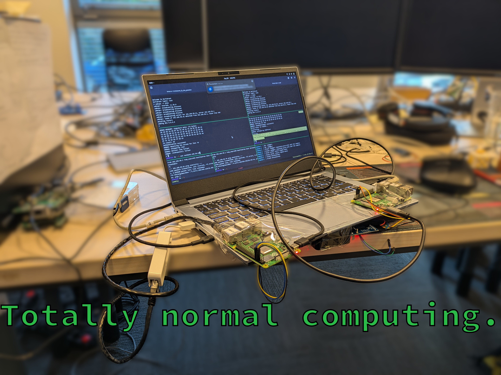

## Context Based Auth.: Identifying host by environment

    

---

## echo $(whoami)

**Mateusz Kusiak**

_Former System Software Development Engineer at Intel_

_Currently a Junior Embedded Systems Developer at 3mdeb_

_Member of the **Zarhus** team_

- <mateusz.kusiak@3mdeb.com>
- [3mdeb.com](https://3mdeb.com)
- [Personal site](https://danceswithmachines.github.io/)

---

## Location based authentication

<v-clicks>

- Issues with classic geofencing
- Classic CBA
- RFF (Radio Frequency Fingerprinting)
- D2D CBA
- My concerns:
  + Probing resolution
  + Why not use classic identifiers: MAC, IP, etc.

</v-clicks>

---

## Crosscon and the stack

<v-clicks>

- CROSSCON (Cross-Platform Open Security Stack for Connected Devices)
- Main product: [CROSSCON Hypervisor](https://github.com/crosscon/CROSSCON-Hypervisor)
- Stack...
    

        
    

</v-clicks>

---

## **HARD**ware

    

---
layout: cover
class: text-center
---

## Demo

---

## References

References:
- [Crosscon CBA approach](https://crosscon.eu/sites/crosscon/files/public/content-files/2025-03/D3.1%20CROSSCON%20Open%20Security%20Stack%20Documentation%20%E2%80%90%20Draft_v1.0.pdf)
- [Crosscon](https://crosscon.eu/)
- [Crosscon Build system for RPI](https://github.com/crosscon/crosscon-demos-uc12)
- [Crosscon TLS application](https://github.com/crosscon/uc1-2-integration)
- [Reproduction manual](https://github.com/crosscon/uc1-2-integration/blob/main/README.md)
---
layout: cover
---

## Q&A

  

---
src: <SRC>
---
