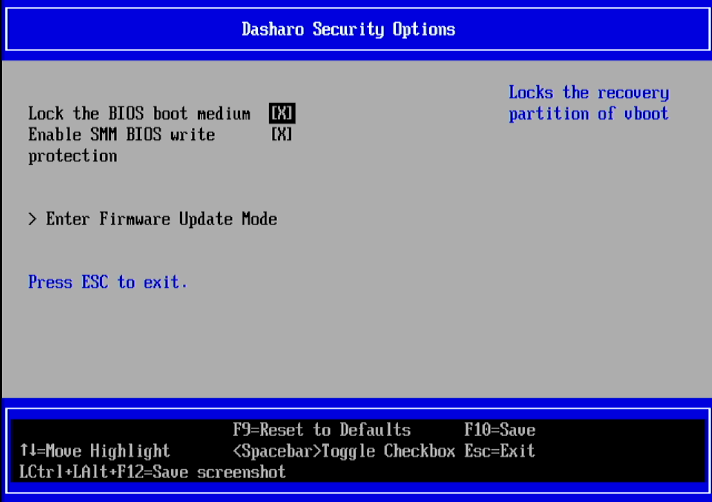

## Stop dreading NIS2: Unlock your firmware digital sovereignty with Zarhus

<center>
  
</center>

---
layout: default
---

## Who am I?

**Kamil Aronowski**

_Junior Embedded Systems Developer at 3mdeb._

_An enthusiast of hot coffee, reasonable security and expression through
writing documents and guides._

<kamil.aronowski@3mdeb.com> : [3mdeb.com](https://3mdeb.com)

---

## Agenda

- The regulatory requirements
- The current situation regarding firmware security
  + reliance on the vendor's implementation
  + reliance on proper key handling and revocations
- Transforming the requirements into being firmly in control
  + supply chain fortification with your own keys (and automating the process)
  + firmware liberation from third-party reliance
- Conclusions
- Q&A

---
layout: default
---

## The regulatory requirements

NIS2 Article 21.2 on Supply Chain Security and Cryptography simplified:

- Supply Chain Security
  + Entities must implement appropriate technical, operational, and
      organizational measures to manage cybersecurity risks related to supply
      chains.
  + Assess vulnerabilities of direct suppliers and service providers,
      including their secure development practices.
  + Take coordinated security risk assessments into account to ensure
      comprehensive supply chain risk management.
- Cryptography Usage
  + Establish policies and procedures for the proper use of cryptography and
      encryption.
  + Cryptographic measures must be appropriate, proportionate, and aligned
      with overall cybersecurity risk management.

---
layout: default
---

## The context of firmware security

- Can you prove that the product hasn't been tampered with in transit?
- Can you rely on the vendor's security implementation?

<center>

Source: <a href=https://www.cvedetails.com/cve/CVE-2025-7026/>cvedetails.com</a>
</center>

---
layout: default
---

## The context of firmware security

- Can you rely on proper key handling and revocations?

<center>
<br>
<br>

<br>
<br>
<br>
Source: <a
href=https://web.archive.org/web/0/https://www.bleepingcomputer.com/news/security/new-uefi-secure-boot-flaw-exposes-systems-to-bootkits-patch-now/>bleepingcomputer.com</a>
</center>

---
layout: default
---

## How to satisfy the requirements then?

One way could mean setting up your own infrastructure to:
- tailor open source firmware to your specific machines
- implement a secure compartment for signing the compiled firmware

Sounds simple in theory, but would likely be a burdensome cost to properly set
up and maintain.

---
layout: two-cols-header
---

## How to satisfy the requirements then?

::left::

<center>

Enter: **Zarhus Trust Root Provisioning Box**

<br>
<br>
<br>

Your machine, your firmware, <br>
YOUR keys, **YOU are in control!**

<br>
<br>
<br>

In an automated, easy-to-use way!

</center>

::right::

<div class="flex justify-center items-center">
  
</div>

---
layout: default
---

## Supply Chain Fortification with your own keys

- Create your keys with

    ```sh
    $ zarhus storage create
    ```

- and choose your flash drive where they will be stored:

    ```sh
    Checking available USB flash drives
    Choose USB flash drive to use for encrypted storage.
    All data on this device will be lost!
    c: Cancel
    0: Kingston - DataTraveler 3.0, /dev/sdb
    1: Wilk - USB 3.2 gen. 1, /dev/sda
    Your choice:
    ```

---
layout: default
---

## Supply Chain Fortification with your own keys

- The keys' storage will be encrypted - enter the encryption password of your
  choice:

    ```sh
    Enter password for encrypted storage:
    ```

- The encrypted storage has been created successfully!

---
layout: default
---

## Supply Chain Fortification with your own keys

- Boot Guard enforces manufacturer-defined boot policies to block unauthorized
  boot code.
  **But it's YOU, who is in control!** Let's generate the Boot Guard keys...

    ```sh
    $ zarhus prepare --eom
    Generating Intel BootGuard keys
    Choose your Intel BootGuard keys name (without spaces): ZPB_IBG
    ```

- ...and get your firmware binary provisioned automatically

    ```sh
    zarhus-dtrpb-fw.cap was provisioned successfully
    Updating Zarhus Provisioning Box firmware
    Queue firmware update
    Firmware will be updated during reboot!
    Press Enter to reboot
    ```

---
layout: default
---

## Supply Chain Fortification with your own keys

<br>
<center>
<div class="flex justify-center items-center">
  
</div>
<p style="font-size: 18px;">Boot process guarded - your way!</p>
</center>

---
layout: default
---

## Supply Chain Fortification with your own keys

You'll also be in control of your own UEFI Secure Boot keys:

```sh
$ zarhus provision-secure-boot

Generating Secure Boot keys
Choose your Secure Boot keys name: ZPB_SB

Created Owner UUID 1cd64494-c5c7-4688-bf6a-e200d38fcc00
Creating secure boot keys...+
Secure boot keys created!
Signing Unsigned original image
Signing Unsigned original image
Enrolling keys to EFI variables...+
Enrolled keys to the EFI variables!
Secure boot was provisioned! Make sure to reboot
```

Once rebooted, your Provisioning Box runs the images YOU control.

---
layout: default
---

## Supply Chain Fortification with your own keys

<br>
<center>
<div class="flex justify-center items-center">
  
</div>
<p style="font-size: 12px;">...and the chains that supply the fortification of
your machines</p>
</center>

---
layout: default
---

## Firmware liberation from third-party reliance

**Now that you've got your keys, it's time to provision [Dasharo
firmware](https://www.dasharo.com/) your way!**

<br>
<br>
<div class="flex justify-center items-center">
  
</div>

---
layout: default
---

## Firmware liberation from third-party reliance

The steps are simple:
- download the firmware and copy it to a USB flash drive,
- mount the drive to your Provisioning Box,
- provision!

---
layout: default
---

## Firmware liberation from third-party reliance

In practice, it's about pasting a few commands:

- download the firmware and copy it to a USB flash drive,

```sh
$ ./share-fw download firmware.cap
```

- mount the drive to your Provisioning Box,

```sh
$ sudo mount /dev/disk/by-label/fw-bin /mnt
```

- provision!

```sh
$ zarhus provision /mnt/<path/to/firmware>.cap

Choose your keys:
c: Cancel
g: Generate new
0: Zarhus_IBG
Your choice: 0

Provisioning binary
firmware.cap was provisioned successfully
```

---
layout: default
---

## Firmware liberation from third-party reliance

You're now ready to deploy the firmware signed with your own keys!

```console
# fwupdtool install-blob firmware.cap
```

---
layout: default
---

## Conclusions

We have demonstrated, how the Supply Chain security can be fortified with the
keys YOU control, and mitigate the risks of insecurities that come with closed
source IBV implementations.

We have also showcased, how easy it is to provision the [Dasharo
firmware](https://www.dasharo.com/) signed with your own keys and deploy it to
your machines, ensuring long-term maintenance, transparent validation,
privacy-respecting implementation, and trustworthiness.

---
layout: two-cols-header
---

## Conclusions

NIS2 introduces stringent cybersecurity obligations, particularly around supply
chain security and cryptography requirements. Meeting these new, broad-ranging
requirements is seen as complex and resource-intensive.

It does **not** have to be seen this way, as we've demonstrated!

Using appropriate tools for each specific context is essential to enhance ease
of use and implement security by design.

::left::

<div class="flex justify-center items-center">
  
</div>

::right::

<div class="flex justify-center items-center">
  
</div>

---
theme: ../slidev-template/theme
layout: cover
background: /intro.png
class: text-center
---

## Q&A

<center>
  
</center>
